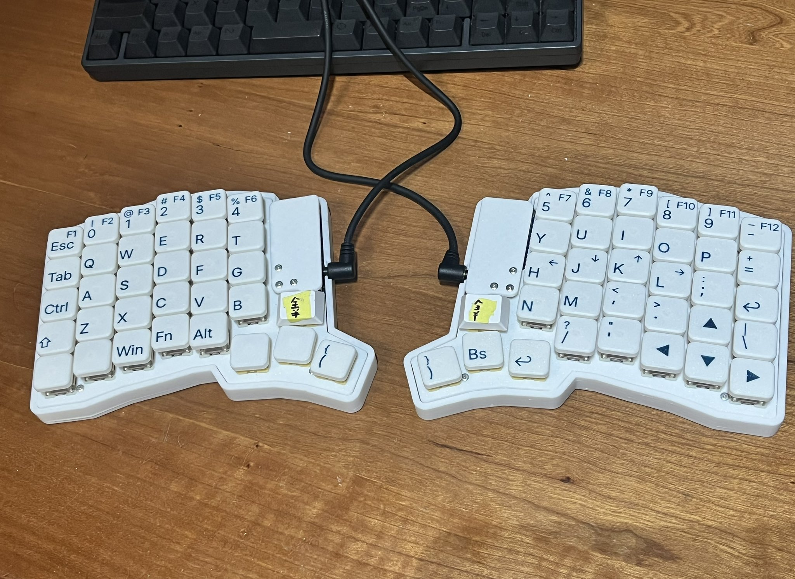

# Keycap Builder Web

This app can make your own keycap with legend!



This project uses [`openscad-wasm`](https://github.com/openscad/openscad-wasm) under the hood to
generate stl from `.scad` files.

> [!TIP]
> If you wanna it run locally or use different keycap base, you can use offline version! [Keycap Builder](https://github.com/ruchi12377/keycap_builder)

## Features

You can make your own key cap with legend text!

## Environment

- Bambu Lab A1 & AMS Lite (0.2mm nozzle) (or compatible color-printable 3D printer)
- [ELEGOO PLA filament](https://amzn.asia/d/7IzwUUX) for base (I choose white.)
- [ELEGOO PLA filament](https://amzn.asia/d/7IzwUUX) for legend (I choose navy. Pretty cool!)

## Dev

Local Development

```bash
git clone https://github.com/ruchi12377/keycap_builder_web
npm i
npm run dev
```

Format .scad file

```bash
npm install -g opensad-format
openscad-format -i ./public/Keycap.scad
```

## Todo

## Credit

This app wouldn't be possible without the work of

- [OpenSCAD](https://openscad.org/)
- [openscad-wasm](https://github.com/openscad/openscad-wasm)
- [openscad-playground](https://github.com/openscad/openscad-playground)
- [openscad-web-gui](https://github.com/seasick/openscad-web-gui)

I sincerely want to say thank you for seasick.
I can't done this project without seasick's hard work.

## Note

If you have any questions, please contact me on [Twitter](https://twitter.com/Ruchi12377)!
